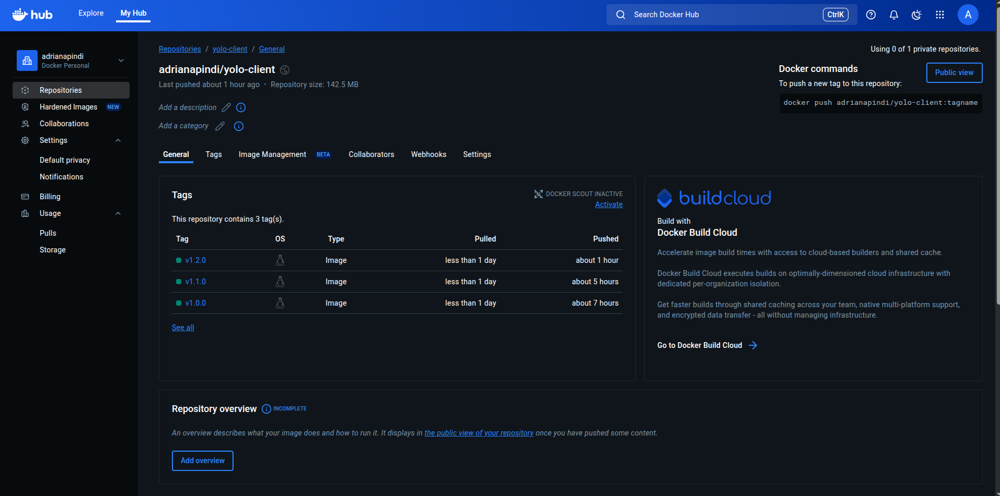
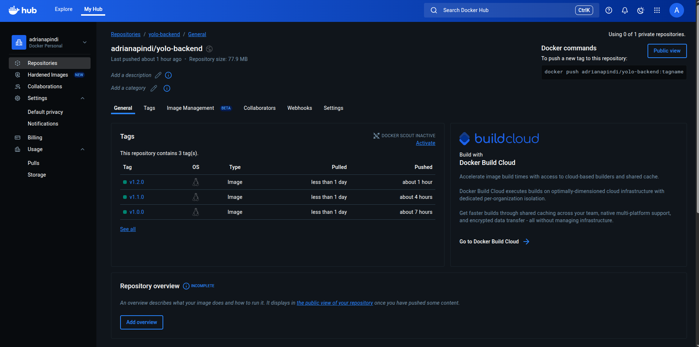

#   Explanation for Docker Project

# 1. Choice of Base Image

I used lightweight and stable images to ensure proper working performance and to also achieve smaller image sizes:

    - Frontend:
        Base image : node:18-alpine
        I used this base image to minimize on the amount of space used since Alpine is lightweight and to also maintain the compatibility with React npm.
    
    - Backend:
        Base image: node:18-alpine
        The Backend uses Express and MOngoDb connection drivers. Node 18 is compatible with all of the packages, and the size of the image is kept small by Alpine.

# 2. Dockerfile Directives

    - A multistaged build was used for both frontend and backend Dockerfile to reduce the image sizes and remove unnecessary build tools.
    
    -Both the frontend and backend Dockerfile is structured using standard practices i.e WORKDIR, COPY, EXPOSE ...

# 3. Docker Compose Networking

    -i used a custom network called yolo-net and implemented a bridge network to allow for the communication of the frontend, backend and the MongoDB containers to communicate internally.

    - The backend connects to MongoDB using mongodb://app-ip-mongo:27017/yolomy

    - The frontend connects to the backend via http://Adih-yolo-backend:5000

# 4. Docker Copose Volume DEfinition

    -I used app-mongo-data for the volume to ensure that the added products are not lost when containers restart.

# 5. Git Workflow
     
    - The repository was forked from the original template and then cloned locally to my machine.  
    - Used multiple descriptive commits to track each major change.  
    - Once confirmed functional, changes were pushed to GitHub.  
    - Docker images were built and pushed to Docker Hub for deployment and verification with proper semantic versioning.

# 6. Successful Running & Debugging Measures
    - I verified that the frontend and the backend communicate successfully.
    - Addressed ERR_OSSL_EVP_UNSUPPORTED in React build by adding:
        environment:
           NODE_OPTIONS=--openssl-legacy-provider

    - Optimized image sizes to be below 400MB
    - Frontend runs on : http://localhost:3000
    - Backend runs on : http://localhost:5000/api/products

# 7. Docker Image Versioning
    - used semantic versioning for both the frontend and the backend images:
        Frontend : adrianapindi/yolo-client:v1.2.0 
        Backend  : adrianapindi/yolo-backend:v1.2.0

# 8. Docker Hub Deployment
    - All images are pushed to Docker Hub with semantic versioning
    - Verify images by running 
        docker pull adrianapindi/yolo-client:v1.2.0
        docker pull adrianapindi/yolo-backend:v1.2.0

The project has been able to containerize the e-commerce web application into the frontend and backend and MongoDB services. Images are optimized and their versioning is done correctly and the system is launched without any issues when used with docker-compose.